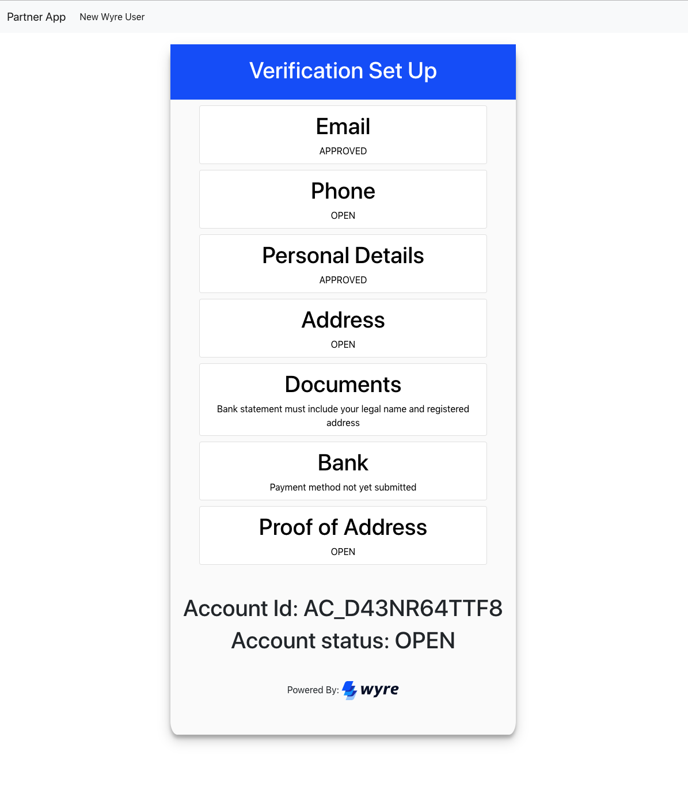

# React <> Wyre API Integration

## READ THIS FIRST

## Architecture

The premise of this React front end application is to give you, Wyre's potential new Partner, a visual insight into the KYC data we need to collect from you, the Partner, along with the status updates from our compliance team regarding the KYC data of your users. There's only 2 types of components in this application.

1. **The UserProfile Component** (displays the status and any notes related to the user that require follow up from our compliance team). All the other components such as addressUserForm, cellPhoneUserForm, etc, extend from the UserProfile class. Each of those components have their own doSubmit function that uses different endpoints from the ./services/wyreApiService.js file. I would suggest you to review over the wyreApiService.js file

2. **The Input Component**. This component allows to create input components dynamically. It is used extensively in each component in the wyreComponents directory

### Wyre Authentication

This React application uses Bearer Token authentication. Read more about authenticating with Wyre's API [here](https://docs.sendwyre.com/docs/authentication).

When you first click on the `New Wyre User` tab, it will take a few seconds for a Wyre Account to generate. Account creation and authentication is handled in the `./services/wyreApiService.js` file. When a new user is present, a secret key is generated and stored in `localStorage` in the browser. An account is then created by hitting Wyre's [create account](https://docs.sendwyre.com/docs/create-account) endpoint. Once the account has been created, the user will be pushed to the `/userProfile` screen.

Once the account has been created, the componentWillMount function checks if a secretKey is in localStorage. If it is, it will call Wyre's [get account](https://docs.sendwyre.com/docs/get-account) endpoint and mount the results of that endpoint to the screen, if not, it will create a new account via the mechanism describe in the previous paragraph.

## Available Scripts

To start the application, run:

#### `git clone https://github.com/sendwyre/wyreAPI-react-integration.git`

#### `cd wyreAPI-react-integration`

#### `npm i`

#### `npm start`

click on the `New Wyre User` tab on the navigation bar.

Runs the app in the development mode. 
Open [http://localhost:3000](http://localhost:3000) to view it in the browser.

The page will reload if you make edits. 
You will also see any lint errors in the console.
